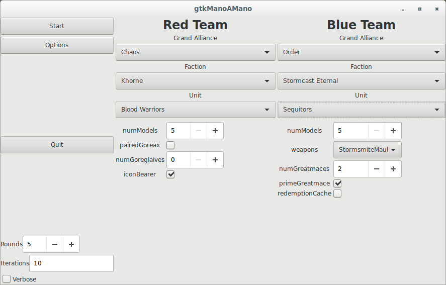

# AoSManoAMano
AosManoAMano simple Warhammer Age of Sigmar&trade; battle simulator.
The application permits two units to conduct a simulated Age of Sigmar battle.  These
units are called Player 1 or Red and Player 2 or Blue.
The battle is conducted following the Age of Sigmar 2.0 core rules.  The battle starts
with an initiative roll for first turn and then progresses through a multi-turn simulation
of an Age of Sigmar battle.  The application aims to simulate each phase of the
game; Hero, Movement, Shooting, Charge, Combat and Battleshock.  The default simulation is a 5
round battle.

## Why Bother?
This simulation attempts to answer questions like are 10 Liberators better than
10 Sequitors and by how much?  The simulations can run thousands of times to 
collect a set of statistics on battle results.  These statistics can then be used
to determine the strength or weaknesses of various matchups.  Experiments can
be done quickly with various weapon configurations to find the strongest setups to combat a
particular enemy unit.

## What Works?
Age of Sigmar is complex and rich game with a myriad of rules.  Not of all those rules have been
captured by the simulation.  The goal of this application is to conduct simple 1 vs 1 battles.
To support this goal the simulation supports initial unit deployment on a small(ish) battle
field.  Units support basic hero phase abilities, movement towards the enemy, simple spell casting and
ranged and melee combat.

## What Does Not Work?
The short answer is quite a lot.  The simulation is very much a work in progress.  The big items
that are missing include spells in general, many many units have not been implemented and per-model
movement.  The 'intelligence' of the simulated units is quite primitive and in need of more
work to make them 'think' strategically.  Currently units attempt to move or run toward their
opponent if they prefer melee combat.  Shooting unit move to try to get in range for shooting.   To keep
movement simple the simulation treats all models in a unit as having the same position.  This simplification
makes movements and range checking simple and is satisfactory for the purposes of this simulation.

## Building
AoSManoAMano is written in modern C++ (C++14) and intended to be highly portable.  Currently only 
Linux (or Unix-like) platforms are supported.  The build system uses CMake and follows the 
normal CMake build pattern.

    % mkdir build
    % cd build
    % cmake ..
    % make
  
## Running
The build produces an executable called AoSManoAMano.  The simulation supports a command 
line only interface currently.

    Age of Sigmar: Mano a Mano simulation.
    Usage: 
      ./AoSManoAMano [OPTION...]

    -h, --help            Print help
    -l, --list            List supported units
    -f, --faction all     List units the given faction
    -r, --rounds arg      Number of battle rounds
    -v, --verbose arg     Verbosity level
    -1, --red arg         Player 1 (Red) Unit
    -2, --blue arg        Player 2 (Blue) Unit
    -s, --save            Save battlemaps
        --mapname arg     Battlemap basename
    -i, --iterations arg  Number of battle iterations
    -w, --weapons none    List weapons for the given unit

Player units are specified using the following format:

    "<unit name>,<param1=value1>,<param2=value2>..."
    
Use the --list and --verbose options to see a list of supported unit and their parameters.  Supported
units include the following:

    Beasts of Chaos:
        Bestigors
        Bullgors
        Centigors
        Cygor
        Doombull
        Ghorgon
        Gors
        Ungors

    Deathrattle:
        Black Knights
        Grave Guard
        Skeleton Warriors
        Wight King with Baleful Tomb Blade
        Wight King with Black Axe

    Dispossessed:
        Hammerers
        Ironbreakers
        Irondrakes
        Longbeards
        Quarrellers
        Thunderers
        Warriors

    Daughters of Khaine:
        Avatar of Khaine
        Blood Sisters
        Blood Stalkers
        Bloodwrack Medusa
        Doomfire Warlocks
        Hag Queen
        Khinerai Lifetakers
        Sisters of Slaughter
        Slaughter Queen
        Witch Aelves

    Eldritch Council:
        Archmage
        Archmage On Dragon
        Loremaster
        Swordmasters

    Flesh Eater Courts:
        Abhorrant Archregent
        Abhorrant Ghoul King
        Abhorrant Ghoul King on Terrorgheist
        Abhorrant Ghoul King on Zombie Dragon
        Crypt Flayers
        Crypt Ghast Courtier
        Crypt Ghouls
        Crypt Haunter Courtier
        Crypt Horrors
        Crypt Infernal Courtier
        Royal Terrorgheist
        Royal Zombie Dragon
        Varghulf Courtier

    Gloomspite Gitz:
        Aleguzzler Gargant
        Boingrot Bounderz
        Colossal Squig
        Dankhold Troggboss
        Dankhold Troggoths
        Fellwater Troggoths
        Loonboss
        Loonboss on Giant Cave Squig
        Loonboss on Mangler Squigs
        Loonboss with Giant Cave Squig
        Mangler Squigs
        Rockgut Troggoths
        Shootas
        Skragrott
        Spider Riders
        Squig Gobba
        Squiq Herd
        Squiq Hoppers
        Stabbas

    Greenskinz:
        Orruk Boar Chariots
        Orruk Boarboys
        Orruk Great Shaman
        Orruk Warboss
        Orruk Warboss on Wyvern
        Orruks
        Rogue Idol

    Idoneth Deepkin:
	    Akhelian Alloplexes
	    Akhelian Ishlaen Guard
	    Akhelian King
	    Akhelian Leviadon
	    Akhelian Morrsarr Guard
	    Namarti Reavers
	    Namarti Thralls

    Ironjawz:
	    Orruk Ardboys
	    Orruk Brutes
	    Orruk Gore-gruntas
	    Orruk Megaboss

    Khorne:
        Blood Warriors
        Bloodcrushers
        Bloodletters
        Bloodmaster
        Bloodreavers
        Bloodthirster Of Insensate Rage
        Bloodthirster Of Unfettered Fury
        FleshHounds
        Karanak
        Khorgoraths
        Mighty Skullcrushers
        Skarbrand
        Skullmaster
        Skullreapers
        Skulltaker
        Wrath Of Khorne Bloodthirster
        Wrathmongers

    Nighthaunt:
        Bladegheist Revenants
        Chainghasts
        Chainrasp Horde
        Dreadscythe Harridans
        Glaivewraith Stalkers
        Grimghast Reapers
        Hexwraiths
        Spirit Hosts

    Nurgle:
        Beasts of Nurgle
        LordOfPlagues
        Plaguebearers
        Putrid Blightkings
        The Glottkin

    Skaven:
        Clanrats
        Gutter Runners
        Hell Pit Abomination
        Night Runners
        Plague Monks
        Ratling Gun
        Stormfiends
        Stormvermin
        Warp Lightning Cannon
        Warpfire Thrower

    Slaanesh:
	    Daemonettes
	    Fiends
	    Seekers

    Stormcast Eternals:
        Castigators
        Celestar Ballista
        Concussors
        Decimators
        Desolators
        Evocators
        Evocators on Celestial Dracolines
        Fulminators
        Gavriel Sureheart
        Gryph-hounds
        Judicators
        Knight-Incantor
        Knight-Questor
        Knight-Zephyros
        Liberators
        Lord-Celestant
        Lord-Celestant-on-Dracoth
        Lord-Celestant-on-Stardrake
        Lord-Ordinator
        Neave Blacktalon
        Prosecutors
        Protectors
        Retributors
        Sequitors
        Tempestors
        Vandus Hammerhand
        Vanguard-Hunters
        VanguardRaptorsHurricane
        VanguardRaptorsLongstrike

    Sylvaneth:
        Alarielle
        Branchwraith
        Branchwych
        Dryads
        Drycha Hamadreth
        Kurnoth Hunters
        Spirit of Durthu
        Spite-Revenants
        Tree-Revenants
        Treelord
        Treelord Ancient

    Tzeentch:
        Flamers Of Tzeentch
        Kairic Acolytes
        Pink Horrors
        Tzaangor Enlightened
        Tzaangors

    Wanderers:
	    Eternal Guard
	    Glade Guard
	    Wildwood Rangers
    
    
The following specifies the parameters needed to create a unit of 10 Liberators with 2 Grandhammers.

    "Liberators,numModels=10,numGrandhammers=2"    
    
To simulate a battle between a unit of 10 Liberators and 20 Bloodreavers use the following command:

    % AosManoAMano -v -1 "Liberators,numModels=10,numGrandhammers=2" -2 "Bloodreavers,numModels=20,iconBearer=true,hornblowers=true"

The simulation supports a primitive graphic output depicting the location and number of remaining models for each
player as a PNG image.  An image is created after unit deployment, each battle round and at the end of the battle.  Use the --save and
--mapname arguments to enable the map generation.    
        
## gtkManoAMano

gtkManoAMano is a simple GUI wrapper for the AoSManoAMano simulation.  The UI allows the user to configure
two units to battle.   The UI allows control over the unit size, weapon selections and other special options.  Currently the 
result are only logged to the console.   
        

## Future Plans

1. Windows, Android and iOS ports.
2. Improve look and feel Gtk GUI wrapper.
3. Additional units and more abilities.
4. Improve simulation to include spells, prayers and other buffs/de-buffs.
5. Implement per-model positioning and pile in movement.
6. More statistics and data collection.
7. Expand to allow multiple units for each player.
8. Import rosters from the various roster generation tools like BattleScribe or Warscroll Builder.
9. ????

    
